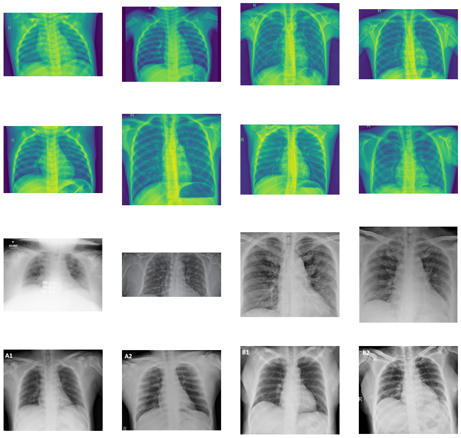
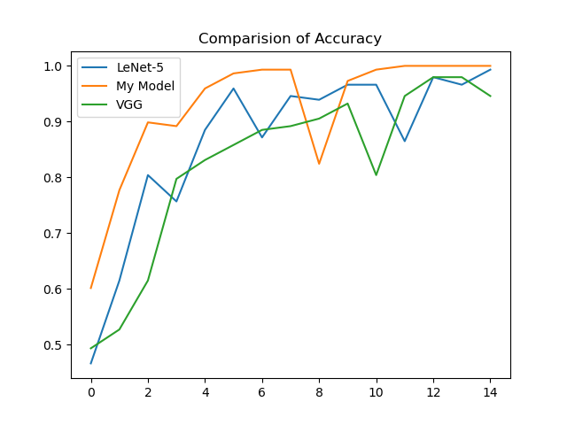
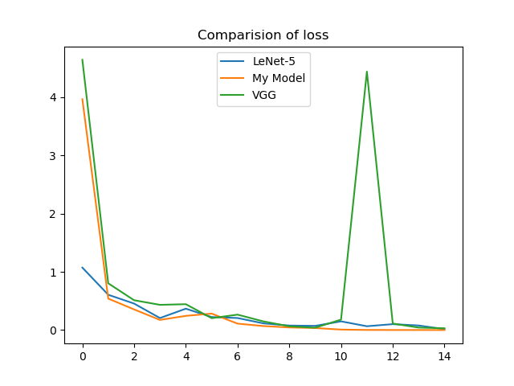
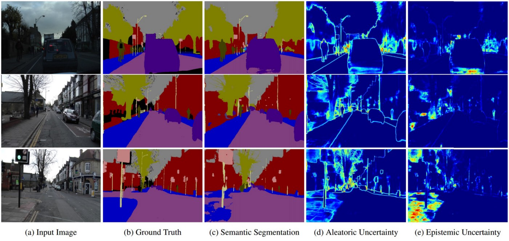

# Q1. Summary

Implemented deep learning on my dataset with varying degrees of depth, and included a comparative analysis between them.

# Q2. Dataset description

## Dataset Description

The 2019 novel coronavirus (COVID-19) presents several unique features. While it is diagnosis mostly using polymerase chain reaction (PCR), infected patients with pneumonia may present on chest X-ray and computed tomography (CT) scan images with a pattern that is only moderately characteristic for the human eyes. COVID-19’s rate of transmission depends on our capacity to reliably identify infected patients with a low rate of false negatives. In additions, lower rate of false positive means giving less burden to patients and unecessarily exposing patients to medications and quarantines. Im later January, a chinese team published a paper on clinical and paraclinical features of COVID-19. They suggested that COVID-19 does affect your chest CT scans when infected compared to normal ones.

In this dataset,we have divided data into training and testing data. These data contains images of chest CT scans of patients with Pneumonia and Normal chest. The train data contains 74 images of patients with Pneumonia and Normal each while test data contiains 20 images of Pneumonia and Normal each. the input size for our image is 150 x 150 pixels. These size is used as an input for our deep learning CNN model.

## AUC Values
-

# Q3. Details

Comparing the 3 models with different architectures:

1. LeNet-5 architecture(Conv-Pool-Conv-Pool-Flatten-Flatten-Dense-Softmax)

LeNet-5 architecture is one of the former deep learning models and have been aiding thousands of studies as a benchmark model. Same way I also used this model to compare my model and anothero one. This model has the structure of **Cov2D -> PoolMax -> Cov2D -> PoolMax -> Flat -> Flat -> Dense -> Output**

2. Enhanced model from analysis

Here, I have used different approach as I wanted to check if more cov2D or less cov2D does affect the accuracy of mode. It turns out yes, it does. The accuracy of VGG is lesser than LeNEt-5 and my model. Also, difference between my model and LeNet-5 is that there is one less flat layer and one more dence layer. The structure of my model is:
**Cov2D -> PoolMAx -> Cov2D -> PoolMax -> Flat -> Dense -> Desne -> Output**

3. VGG like model 

VGG- Network is a convolutional neural network model proposed by K. Simonyan and A. Zisserman in the paper “Very Deep Convolutional Networks for Large-Scale Image Recognition”. This architecture achieved top-5 test accuracy of 92.7% in ImageNet, which has over 14 million images belonging to 1000 classes. The structure for the model is:
**Cov2D-Cov2D-PoolMax-Cov2D-Cov2D-Pool-Flat-Dense-Output**

|        Model       |Accuracy            |
|:-------------------|:------------------:|
| LeNEt-5            | 0.9072072227795919 |
| Enhanced Model     | 0.8837837974230448 |
| VGG like model     | 0.842792805035909  |

- Accuracy curve

Accuracy curve for 3 models were plotted and compared. The plots show accuracy for 15 epochs. The trend observed in the graph suggests that my model is doing really good. The other 2 models, i.e., LeNet-5 and VGG type model show lower accuracy than my model. The reason being we are not giving more layers to covolutional 2D which would leak information when transmitting to next layers. Thus my model has least of all convolutional layers and 2 flat layers which makes it more relaiable and accurate.

 

- Loss curve

The loss curve suggest how much error is present for prediction. This gives an idea about which model performs better on validation data. From the plot below, we can identify that LeNEt-5 and my model have the least accuracy overall. We can easily see from the plot that there is spike in VGG's loss function, the reson being that VGG Loss is a type of content loss introduced in the Perceptual Losses for Real-Time Style Transfer and super-resolution and style transfer framework. It is an alternative to pixel-wise losses; VGG Loss attempts to be closer to perceptual similarity.

- Types of uncertainity:

I. Epistemic uncertainty describes what the model does not know because training data was not appropriate.Epistemic uncertainty is due to limited data and knowledge. Given enough training samples, epistemic uncertainty will decrease. Epistemic uncertainty can arise in areas where there are fewer samples for training.

II. Aleatoric uncertainty is the uncertainty arising from the natural stochasticity of observations. Aleatoric uncertainty cannot be reduced even when more data is provided. When it comes to measurement errors, we call it homoscedastic uncertainty because it is constant for all samples. Input data-dependent uncertainty is known as heteroscedastic uncertainty.

These 2 uncertianities play really important role in choosing the right model with lest uncertainity. The below immage shows the difference it makes and how it compares to other input images.

Also the application of calculating these uncertainites also lie in explainable A.I. This would show how uncertain our model is based on the predictions we get and how the model is interpeting the images. 

- Conclusion:

From the above analysis we get to know that increasing convolutional layers doesnt not improve the accuracy or decrease the loss function. The LeNet-5 and my model has 3 convolutional 2D layers while VGG has 5 Cov2D layers. Also the function used in the output layer matters a lot. I tried with "softmax" function for all three models, but it did not give correct accuracy. The reason being, my output was coming out as integers as 0s and 1s and not the predicted probabilities of the test sample. Hence I had to change my function for output layer to "Sigmoid". Also, from the studies it was suggessted that more Cov2D layer means more complex features to be dealt with which it can improve accurayc of the predicting.